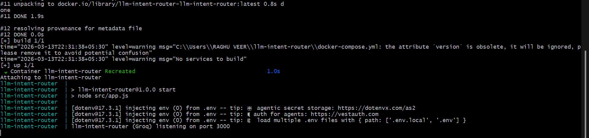
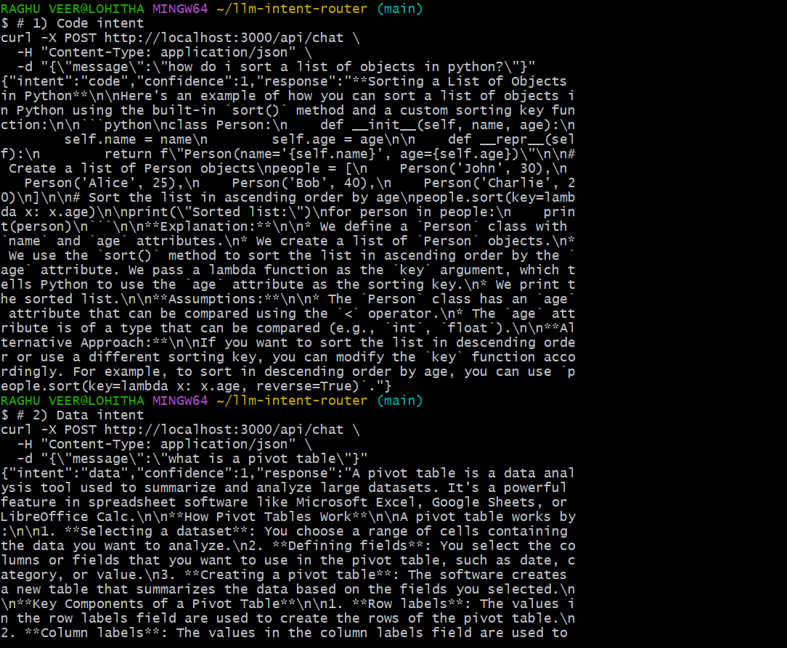
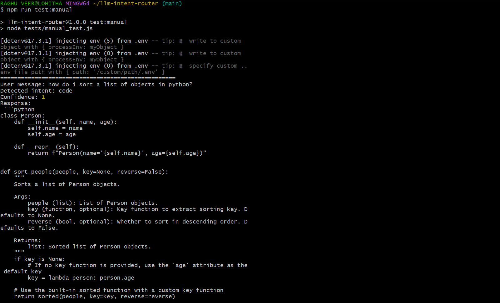

# LLM Intent Router

This project is a small backend service that routes a user's message to the right AI “expert” based on their intent.

Instead of using one large prompt for everything, the system first **classifies the user's intent** and then sends the request to a **specialized AI persona** like a Code Expert or Writing Coach.

I built this project as part of the **Partnr Global Placement Program task: “Build an LLM-Powered Prompt Router for Intent Classification.”**

---

# What the Project Does

Many real AI systems use multiple prompts instead of one huge prompt.  
This project demonstrates a simple **prompt routing architecture**.

Workflow:

1. The user's message is sent to a **classifier model**.
2. The classifier predicts the user's intent.
3. The request is routed to a **specialized AI persona**.
4. The AI generates the final response.
5. The routing decision is logged for observability.

All requests are recorded in `route_log.jsonl`.

---

# Supported Intents

The classifier detects one of the following labels:

- `code` – programming help
- `data` – data analysis questions
- `writing` – writing improvement and feedback
- `career` – career advice
- `unclear` – message is too vague

Each intent maps to a different **system prompt persona**.

---

# Tech Stack

- **Node.js**
- **Express**
- **Groq LLM API**
- **OpenAI Node.js client**
- **Docker / Docker Compose**

The Groq API is used through the OpenAI compatible endpoint:

```

[https://api.groq.com/openai/v1](https://api.groq.com/openai/v1)

```

This allows fast inference while keeping the same API interface.

---

# Architecture

The system follows a **Classify → Route → Respond** pattern.

```

User Message
│
▼
Classifier (LLM)
│
▼
Intent Label
│
▼
Router
│
▼
Persona Prompt
│
▼
LLM Response
│
▼
JSONL Logging

```

---

## Screenshots

### Docker Build Status


### API call success


### Manual tests + intents


## Demo Video

**Demo Video:**  
https://youtu.be/your-demo-video-link
# Project Structure

```

.
├── config
│   └── prompts.json
├── src
│   ├── app.js
│   ├── classifier.js
│   ├── router.js
│   └── logger.js
├── route_log.jsonl
├── Dockerfile
├── docker-compose.yml
├── .env.example
└── README.md

```

### Important Files

**app.js**

Starts the Express server and exposes the API endpoints.

**classifier.js**

Implements `classifyIntent(message)` which sends a prompt to the LLM and returns:

```

{
"intent": "code",
"confidence": 0.92
}

```

**router.js**

Handles routing logic:

- manual overrides
- confidence threshold
- persona prompt selection
- final response generation

**logger.js**

Writes routing decisions to `route_log.jsonl`.

**prompts.json**

Stores all persona system prompts.

---

# Personas

The router uses different system prompts depending on the intent.

### Code Expert
Provides clear code solutions and short explanations.

### Data Analyst
Explains statistics, distributions, and analysis methods.

### Writing Coach
Gives feedback on clarity, structure, and tone.

### Career Advisor
Provides practical career advice and next steps.

### Clarification Assistant
Used when the message is too vague.

---

# Routing Logic

The router follows a few simple rules.

### 1. Manual override

Users can force a route using prefixes:

```

@code
@data
@writing
@career

```

Example:

```

@code how do i reverse a list in python

```

This bypasses the classifier.

---

### 2. Classifier call

If no override is detected:

```

intent = classifyIntent(message)

```

The classifier returns:

```

{
intent: "code",
confidence: 0.93
}

```

---

### 3. Confidence threshold

If confidence is too low, the intent becomes `unclear`.

Example threshold:

```

0.7

```

---

### 4. Clarification flow

If the intent is `unclear`, the system asks a follow-up question instead of guessing.

Example:

```

Are you asking about programming, data analysis,
writing feedback, or career advice?

```

---

# API Endpoints

## Health Check

```

GET /health

````

Example response:

```json
{
  "status": "ok"
}
````

---

## Chat Endpoint

```
POST /api/chat
```

Request body:

```json
{
  "message": "how do i sort a list in python"
}
```

Example response:

```json
{
  "intent": "code",
  "confidence": 0.94,
  "response": "You can sort a list in Python using..."
}
```

---

# Logging

Every request is logged in `route_log.jsonl`.

Example entry:

```json
{
 "intent":"code",
 "confidence":0.91,
 "user_message":"how do i sort a list in python",
 "final_response":"You can use the sorted() function...",
 "timestamp":"2026-03-13T10:11:23Z"
}
```

This helps track routing decisions and debug behavior.

---

# Setup

### Requirements

* Node.js 18+
* Groq API key
* Docker (optional)

---

# Installation

Clone the repository:

```
git clone https://github.com/lohithadamisetti123/llm-intent-router.git
cd llm-intent-router
```

Install dependencies:

```
npm install
```

---

# Environment Variables

Create a `.env` file from the example:

```
cp .env.example .env
```

Example configuration:

```
GROQ_API_KEY=your_key_here
PORT=3000
CONFIDENCE_THRESHOLD=0.7

GROQ_CLASSIFIER_MODEL=llama-3.1-8b-instant
GROQ_GENERATION_MODEL=llama-3.1-8b-instant
```

---

# Running the Project

Start the server:

```
npm start
```

Server runs at:

```
http://localhost:3000
```

---

# Example Requests

### Code Question

```
curl -X POST http://localhost:3000/api/chat \
-H "Content-Type: application/json" \
-d '{"message":"how do i sort a list in python"}'
```

### Data Question

```
curl -X POST http://localhost:3000/api/chat \
-H "Content-Type: application/json" \
-d '{"message":"what is a pivot table"}'
```

### Writing Question

```
curl -X POST http://localhost:3000/api/chat \
-H "Content-Type: application/json" \
-d '{"message":"this paragraph sounds awkward"}'
```

### Career Question

```
curl -X POST http://localhost:3000/api/chat \
-H "Content-Type: application/json" \
-d '{"message":"how do i start a career in data science"}'
```

### Unclear Message

```
curl -X POST http://localhost:3000/api/chat \
-H "Content-Type: application/json" \
-d '{"message":"hey"}'
```

---

# Manual Testing

Run built-in tests:

```
npm run test:manual
```

This sends multiple sample messages through the router and prints:

* detected intent
* confidence
* generated response

Logs are appended to `route_log.jsonl`.

---

# Docker

Build the container:

```
docker-compose build
```

Run the service:

```
docker-compose up
```

The API will be available at:

```
http://localhost:3000
```

---

# Possible Improvements

If this project were expanded further, the following improvements could be added:

* Add automated **unit tests**
* Build a small **web UI**
* Support more expert personas
* Add analytics dashboard for routing logs
* Use streaming responses for faster replies
